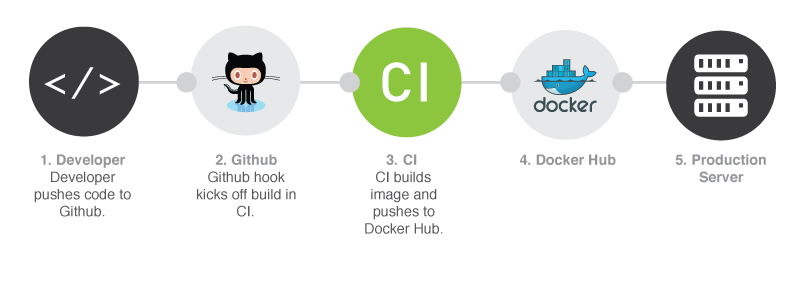

### What is a Container?

- A stand-alone executable package that contains:
	- Code
	- Runtime
	- System tools
	- Libraries
	- Settings

- Isolates software from its surroundings

---

### How do they differ from a VM?


---

### What do they isolate?

- Some examples:
	- Processes
	- File system
	- Shared memory
	- Network
	- Resource (CPU etc.)

---

### What is Docker?

- A container platform
- A set of tools 
- A client and a daemon
- Other options (rkt, clearcontainer etc.)

---

### Create a node js image

- An image is a snapshot of the filesystem
- Used to run a container
- Example Dockerfile
```Dockerfile
FROM alpine
RUN apk update && apk add nodejs
```
- Build the image
```sh
docker image build -t tr/presentation .
```

---

### Run a container

```sh
docker container run -it --rm \
	tr/presentation node
```

---

### ... or pull one

```sh
docker image pull node
```

---

### Create a simple application

- Review the files in the repo, js source & Dockerfile
- Build the image
```sh
docker image build -t \
	travelrepublic/presentation-docker-node
```
- Run the container
```sh
docker container run -it --rm \
	-p 9000:8080 \
	-e ENVIRONMENT=test \
	travelrepublic/presentation-docker-node
```

---

### A simple CI process



---

### Demonstrate CI process

- Review the .travis.yml file
- Change the node version to node:6 and push to the repository
- Keep an eye on travis, pull the newly built image and run locally
